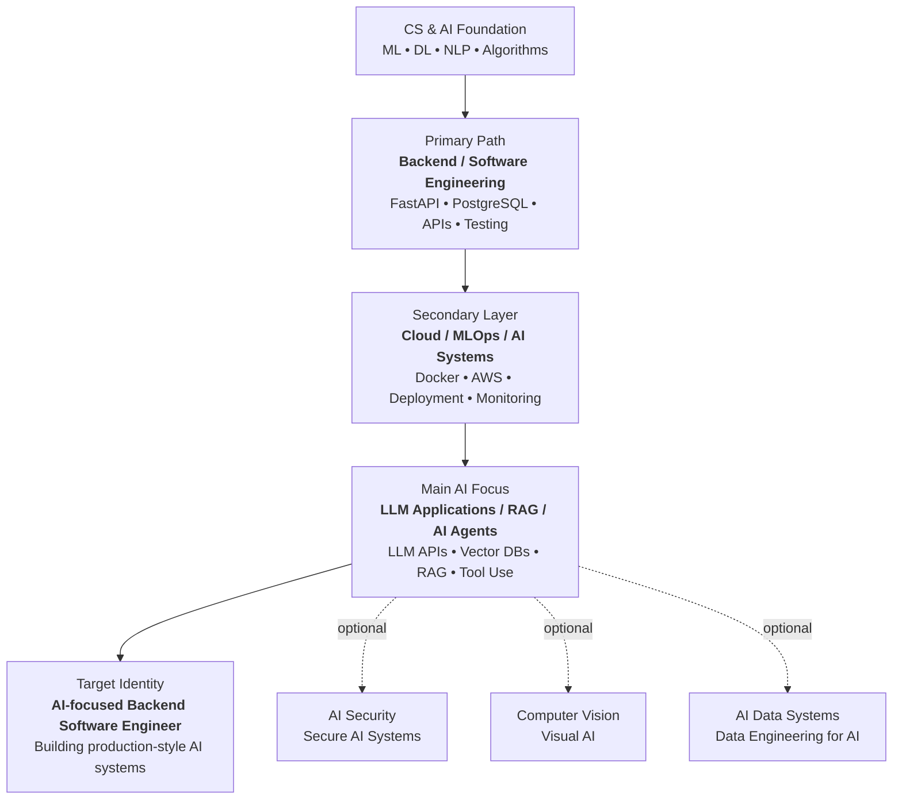

# Hi, I'm Adam Fadel 👋

**CS & AI student building backend and applied AI systems with a focus on LLM/RAG applications.**

I'm studying Computer Science & Artificial Intelligence in Egypt and working toward becoming an AI-focused backend/software engineer who builds production-style AI systems using backend engineering, cloud/MLOps, and practical LLM/RAG application skills.

---

## About Me

- Computer Science & Artificial Intelligence student
- Preparing for Software Engineering and Backend Engineering roles
- Building practical backend and applied AI projects
- Currently focused on Git/GitHub, FastAPI, PostgreSQL, Docker, and cloud deployment
- Interested in LLM applications, RAG systems, AI agents, backend engineering, and cloud/MLOps

---

## Career Direction

My current career direction is:

- **Primary:** Backend / Software Engineering with Applied AI
- **Secondary:** Cloud / MLOps / AI Systems
- **Main AI Focus:** LLM Applications / RAG / AI Agents

Long-term positioning:

> AI-focused backend/software engineer who builds production LLM/RAG applications and AI systems, with cloud/MLOps as the deployment layer.

I may also explore smaller projects in **AI Security**, **Computer Vision**, and **AI Data Systems**, but my main focus is backend + applied AI with LLM/RAG systems.

---

## Roadmap

---

## Tech Stack

I separate tools I currently use from tools I am actively learning so my profile stays accurate.

### Currently Working With

### Actively Learning

### Applied AI Focus

> Tools in the "Actively Learning" and "Applied AI Focus" sections are part of my roadmap and project development, not claimed mastery.

---

## Projects & Roadmap

### Currently Building

#### Study Management API

A backend training project for managing courses, notes, flashcards, tags, and users.

**Goal:** Build strong backend fundamentals through REST APIs, database design, authentication, testing, and clean project structure.

**Planned stack:** Python · FastAPI · PostgreSQL · SQLAlchemy · Pytest

---

### Main Project Roadmap

#### AI Document Intelligence Platform

A backend + applied AI platform for document understanding, PDF upload, summarization, MCQ generation, flashcard creation, and RAG-based question answering.

**What this project will demonstrate:**

- Backend API development
- Database-backed application design
- LLM application development
- Retrieval-Augmented Generation
- Document processing
- Vector database integration
- Deployment-ready project structure

**Planned stack:** FastAPI · PostgreSQL · React/Next.js · LLM APIs · Vector Database · Docker · Cloud Deployment

---

#### AI Agent / Workflow Automation System

A backend-based AI agent system focused on tool use, API integration, workflow automation, and production-style AI system design.

**What this project will demonstrate:**

- AI agent workflow design
- Tool/function calling
- Backend integration
- API orchestration
- Logging and monitoring basics
- Practical AI system thinking

**Planned stack:** FastAPI · PostgreSQL · React/Next.js · LLM APIs · Tool Calling · Docker · Cloud Deployment

---

## Optional Exploration

I may build smaller projects later to test my interest in:

- **AI Security / Secure AI Systems**
- **Computer Vision / Visual AI**
- **AI Data Systems / Data Engineering for AI**

These are exploration areas. My main AI focus remains **LLM Applications / RAG / AI Agents**.

---

## Existing Work

#### Feature Selection Using Genetic Algorithm

A university group project applying genetic algorithms to feature selection for classification tasks.

**My contribution:** Implemented core genetic algorithm components, including population initialization, the fitness function for evaluating selected feature subsets, and the mutation operation for introducing variation across generations.

**Stack:** Python · scikit-learn · pandas · NumPy

---

## Current Learning Roadmap

| Phase | Focus | Status |
|---|---|---|
| 1 | Git / GitHub and terminal workflow | In Progress |
| 2 | Backend APIs with FastAPI | In Progress |
| 3 | PostgreSQL and database-backed applications | Next |
| 4 | React / Next.js basics for project demos | Upcoming |
| 5 | Applied AI systems and RAG pipelines | Upcoming |
| 6 | LLM applications and AI agents | Upcoming |
| 7 | Docker and deployment | Upcoming |
| 8 | AWS / cloud fundamentals | Upcoming |
| 9 | LeetCode and SWE interview preparation | Ongoing |

---

## What I'm Focused On Right Now

- Learning Git/GitHub professionally
- Building backend APIs with FastAPI
- Improving problem-solving through LeetCode
- Building projects that prove practical engineering ability
- Preparing to build production-style LLM/RAG applications

---

## Connect

I'm open to connecting with people working in software engineering, backend systems, applied AI, LLM/RAG applications, AI agents, and cloud/MLOps.

---

*Currently building, learning, and improving toward production-ready backend and applied AI systems.*
